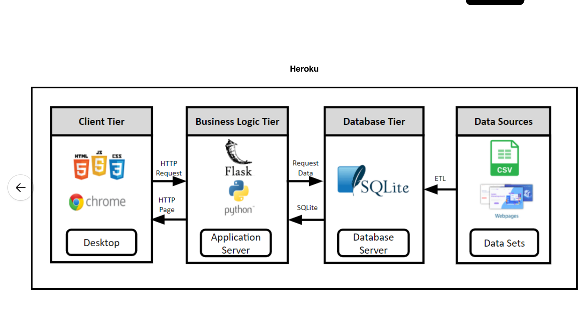
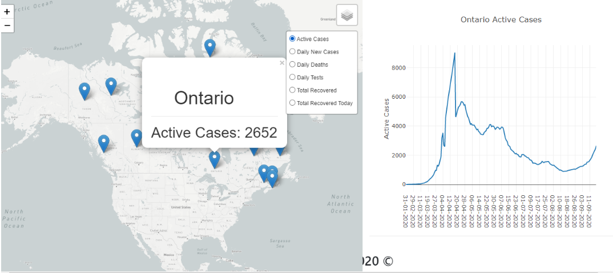
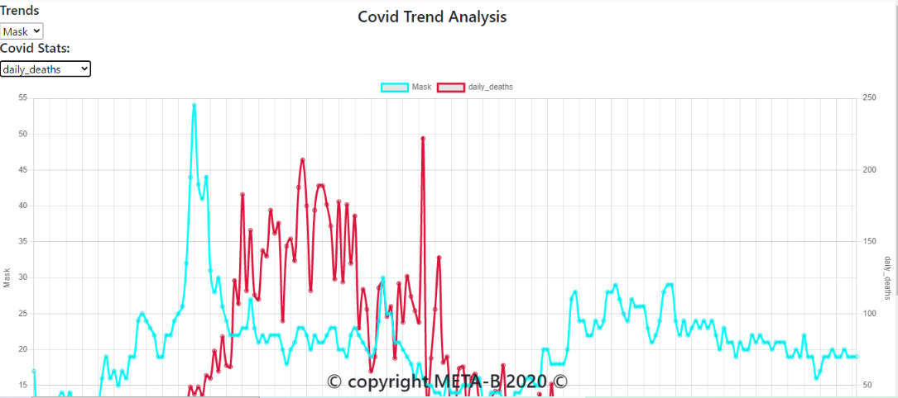
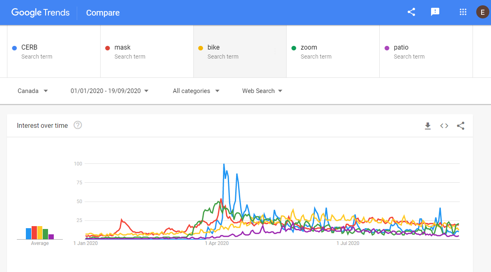
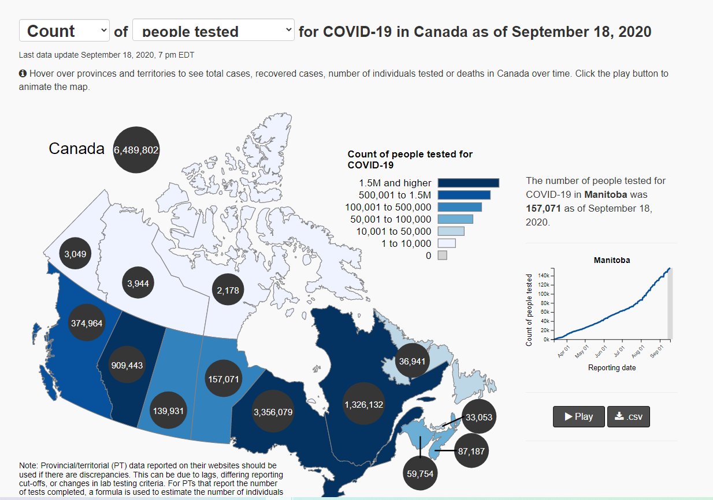

# COVID-19 DATA VISUALIZATION PROJECT

## Background

Welcome to team META-B's COVID-19 visualizations! 

Our members include: Emily Shevell, Maury Agami, Angela Sivirichi, Braden Wang and Tajudeen Adeyemi 

### Topic 
Interactive Dashboard Visualizations of the state of COVID-19 in Canada filtered by province and territory - including common keyword searches during the pandemic. 

### Charts

**Chart 1** : Interactive visualization of COVID-19 count of measures listed below filtered by province and territory.

**Chart 2** : Line graph of filtered province or territory compared to measures listed below

**Chart 3** : Covid cases vs. search trends on google for the following keywords: [bike, mask, CERB, patio, ZOOM].

Measures: 
* People tested
* Cases
* Deaths
* Cases recovered
* Total cases
* Active cases

### Datasets

1. CSV file of cases in Canada. Link: https://health-infobase.canada.ca/covid-19/?stat=num&measure=active#a2

2. CSV file of keyword search trends from Google. 
Link: https://trends.google.com/trends/explore?q=zoom&geo=CA

3. Web scraping for latitude and longitude of provinces and territories. 
Link:  https://www.latlong.net/category/provinces-40-60.html

### App Architecture 

### Process 

**Data Cleaning and SQL**
* 3 Data Sources: 2 CSV files downloaded and 1 table web-sraped 
* Cleaned and merged the raw data into 2 dataframes 
* Stored final data into SQLite database

**APP**

1. Our first step was to connect to our SQLite database where we stored our data.
2. Through this connection, we were able to leverage the flask_sqlalchemy, SQL Alchemy library to read our database and query our database for information.
3. We were then able to query the two tables in our database and store the results from the queries into a Jsonified list. Each query was rendered to a unique API link using flask which allowed our javascript to communicate with the API. 
4. Using templates we rendered our api to our html pages to allow for development of our javascript code.

**Trend Chart**
1. We aimed to compare the relationship between certain key search terms and key Covid-19 metrics overtime in Canada
2. To accomplish this we set about making an interactive chart for various buzzwords such as Patios, Bike, Zoom in relation to new covid cases and daily deaths
3. We saw there was a relationship between the search for masks as daily cases changed over time

**Map Visualization**
1. Pulled data from API and used Leaflet when looping through the data to create the provincial and territorial markers as well as the overlay layers. 
2. Bound popups to each jursidction displaying the jurisdiction name and the most recent data for the selected filter.
3. Generated an "onpopup" open function to capture information from pop up and use it to inform plot on the right 
4. Used plotly to visualize the user's selection for the chosen jurisdiction and filter over time during the pandemic.

**HTML + Final**

1. Created the "skeleton" of our html by providing our scripts and navbar section.
2. Implemented the necessary divs to subdivide our body to display our map properly along side our line chart.
3. After test running our layout with our app, we made the necessary changes to optimize our layout using a combination of CSS, JS, and directly modifying our HTML.
4. Adjusted minor changes to prevent overlapping of values and added our reference points/ "hrefs" to create functioning hyperlinks.
5. Final testing with our app / Heroku.

### Screenshots 

### Inspiration Screenshots

### Github Link

https://github.com/M-Agami/META-B_Vision

